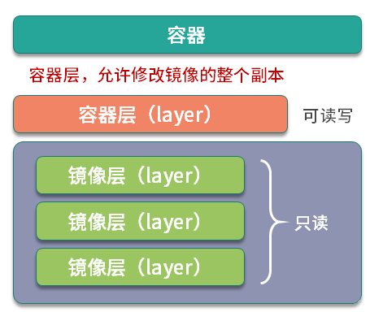
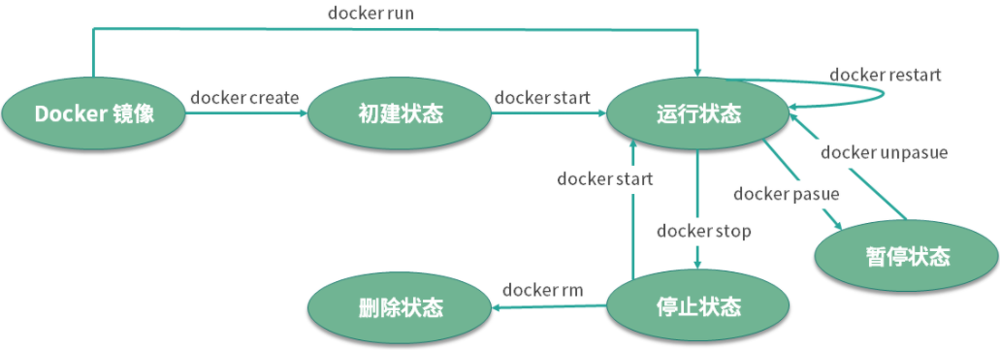

​	    镜像包含了容器运行所需要的文件系统结构和内容，是静态的只读文件，而容器则是在镜像的只读层上创建了可写层，并且容器中的进程属于运行状态，容器是真正的应用载体。接下来讲讲Docker 核心：容器，重点讲解一下容器的基本操作。

### 1. 容器（Container）

容器是基于镜像创建的可运行实例，并且单独存在，一个镜像可以创建出多个容器。



##### 1.1 容器的生命周期
容器的生命周期是容器可能处于的状态，容器的生命周期分为 5 种。

- created：初建状态

- running：运行状态
- stopped：停止状态
- paused： 暂停状态
- deleted：删除状态

各生命周期之前的转换关系如图所示：




docker create命令: 生成的容器状态为初建状态，初建状态通过

docker start命令：可以将初建状态转化为运行状态

docker stop命令：运行状态的容器转化为停止状态

docker start命令：可以将处于停止状态的容器转化为运行状态

docker pause命令：运行状态的容器转化为暂停状态

docker unpause命令：将处于暂停状态的容器转化为运行状态 。

**重点：处于初建状态、运行状态、停止状态、暂停状态的容器都可以直接删除。**


### 2. 容器命令

容器的操作可以分为五个步骤：创建并启动容器、终止容器、进入容器、删除容器、导入和导出容器。

##### 2.1 创建并启动容器

容器启动有两种方式：

1. docker create命令用于创建容器，创建后的容器处于停止状态，然后可以使用docker start命令来启动它。

   ```
   # --name 指定容器的名称  
   # 最后面的busybox为镜像
   docker create -it --name=new_busybox busybox
   
   # 启动刚create创建的容器
   docker start new_busybox
   ```

   

2. 使用docker run命令直接基于镜像新建一个容器并启动，相当于先执行docker create命令从镜像创建容器，然后再执行docker start命令启动容器。

   ```
   docker run -it --name=new_busybox busybox
   ```


当使用`docker run`创建并启动容器时，Docker 后台执行的流程为：

- Docker 会检查本地是否存在 busybox 镜像，如果镜像不存在则从 Docker Hub 拉取 busybox 镜像
- 使用 busybox 镜像创建并启动一个容器, 容器名为new_busybox
- 分配文件系统，并且在镜像只读层外创建一个读写层
- 从 Docker IP 池中分配一个 IP 给容器（在下面会讲解原理）
- 执行用户的启动命令运行镜像


##### 2.2 终止容器

`docker stop`命令：停止运行中的容器。命令格式为 docker stop [-t|--time[=10]]。

该命令首先会向运行中的容器发送 SIGTERM 信号，如果容器内 1 号进程接受并能够处理 SIGTERM，则等待 1 号进程处理完毕后退出，如果等待一段时间后，容器仍然没有退出，则会发送 SIGKILL 强制终止容器。

```
docker stop new_busybox
```

如果你想查看停止状态的容器信息，你可以使用 docker ps -a 命令。

```
docker ps -a
```

处于终止状态的容器也可以通过`docker start`命令和`docker restart`命令来重新启动。

```
docker start new_busybox
docker restart new_busybox
```


##### 2.3 进入容器

处于运行状态的容器可以通过`docker attach`、`docker exec`、`nsenter`等多种方式进入容器。

- **使用**`docker attach`命令**进入容器**

使用 docker attach ，进入我们上一步创建好的容器，如下所示。

```
docker attach new_busybox
```

**注意：**当我们同时使用`docker attach`命令同时在多个终端运行时，所有的终端窗口将同步显示相同内容，当某个命令行窗口的命令阻塞时，其他命令行窗口同样也无法操作。
由于`docker attach`命令不够灵活，因此我们一般不会使用`docker attach`进入容器

- **使用 docker exec 命令进入容器**

通过`docker exec -it CONTAINER /bin/bash`的方式进入到一个已经运行中的容器

```
docker exec -it 容器id /bin/bash
```


##### 2.4 删除容器

删除容器命令的使用方式如下：`docker rm [OPTIONS] CONTAINER [CONTAINER...]`

```
# 删除已经暂停的容器
docker rm 容器名或者容器id

# 删除还在运行中的容器
docker rm -f 容器名或者容器id
```


##### 2.5 导出容器

- **导出容器**

使用`docker export CONTAINER`命令导出一个容器到文件，不管此时该容器是否处于运行中的状态。

执行导出命令：

```
docker export new_busybox > new_busybox.tar
```

执行以上命令后会在当前文件夹下生成 new_busybox.tar 文件，我们可以将该文件拷贝到其他机器上，通过导入命令实现容器的迁移。

- **导入容器**

通过`docker export`命令导出的文件，可以使用`docker import`命令导入，执行完`docker import`后会变为本地镜像，最后再使用`docker run`命令启动该镜像，这样我们就实现了容器的迁移。

导入容器的命令格式为 docker import [OPTIONS] file|URL [REPOSITORY[:TAG]]。接下来将上一步导出的镜像文件导入到其他机器的 Docker 中并启动它。

使用`docker import`命令导入上一步导出的容器

```
docker import new_busybox.tar new_busybox:test
```

此时，new_busybox.tar 被导入成为新的镜像，镜像名称为 new_busybox:test 。下面，我们使用`docker run`命令启动并进入容器，查看上一步创建的临时文件

```
docker run -it busybox:test sh
```

**重点：**通过`docker export`和`docker import`命令配合实现了容器的迁移

### 3. 网络动态IP分配

刚讲到docker run命令的执行时需要从Docker IP 池中分配一个 IP 给容器，接下来重点讲解下该内容。

##### 一、Docker的四种网络模式

Docker在创建容器时有四种网络模式，bridge为默认不需要用--net去指定，其他三种模式需要在创建容器时使用--net去指定。

1. bridge模式，使用--net=bridge指定，默认设置。
2. none模式，使用--net=none指定。
3. host模式，使用--net=host指定。
4. container模式，使用--net=container:容器名称或ID指定。（如：--net=container:30b668ccb630）

**bridge模式：**docker网络隔离基于网络命名空间<Network Namespace>，在物理机上创建docker容器时会为每一个docker容器分配网络命名空间，并且把容器IP桥接到物理机的虚拟网桥上。

**none模式：**此模式下创建容器是不会为容器配置任何网络参数的，如：容器网卡、IP、通信路由等，全部需要自己去配置。

**host模式：**此模式创建的容器没有自己独立的网络命名空间，是和物理机共享一个Network Namespace，并且共享物理机的所有端口与IP，并且这个模式认为是不安全的。

**container模式：**此模式和host模式很类似，只是此模式创建容器共享的是其他容器的IP和端口而不是物理机，此模式容器自身是不会配置网络和端口，创建此模式容器进去后，你会发现里边的IP是你所指定的那个容器IP并且端口也是共享的，而且其它还是互相隔离的，如进程等。


