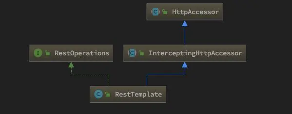
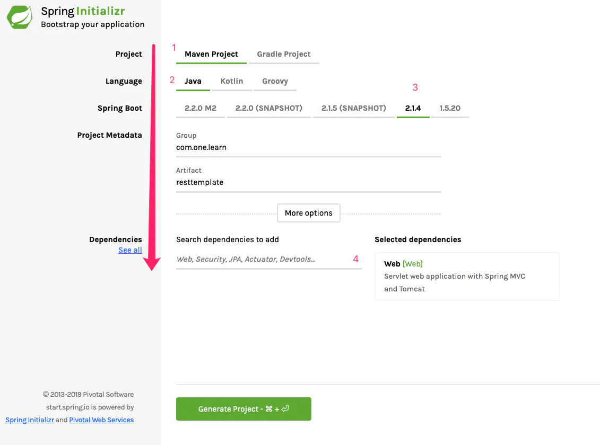
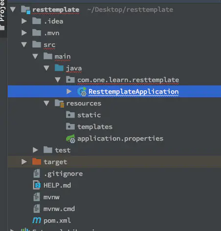
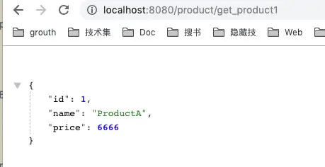

# 掌握 Spring 之 RestTemplate

## 前言

在 Java 服务端开发领域里，Spring 是绕不开的话题，尤其是现在微服务概念盛行，Spring Boot 的出现更是给 Spring 注入了新的活力，除此之外还有 Spring Cloud，这些框架让 Spring 技术体系更加丰富。Spring 从 2014 年的 1.0.0 版本迭代到 现在的 5.2.0 M1 版本，紧随着 Java 语言发展，不断引入新的特性和功能。本文关注的是 Spring 框架中 `RestTemplate` 内容，可以减少我们平时开发常使用的 `HttpClient` API 依赖。文章所涉及的示例 Demo 详见Github 地址：[Resttemplate demo](https://github.com/wrcj12138aaa/resttemplate/tree/master) 。感谢小七同学的认真校对，如果有任何技术问题或者文章纰漏，欢迎留言联系，一起交流探讨 😁。

## 认识 `RestTemplate`

首先在我们学习使用 `RestTemplate` 之前，先认识下这个类，来看 Spring 官方怎么描述的。 从官方 API 文档 [RestTemplate javadoc](https://docs.spring.io/spring-framework/docs/current/javadoc-api/org/springframework/web/client/RestTemplate.html) 可以找该类的描述如下：

> Synchronous client to perform HTTP requests, exposing a simple, template method API over underlying HTTP client libraries such as the JDK HttpURLConnection, Apache HttpComponents, and others. The RestTemplate offers templates for common scenarios by HTTP method, in addition to the generalized exchange and execute methods that support of less frequent cases.

从这里可以清楚地了解到 `RestTemplate` 采用同步方式执行 HTTP 请求的类，底层使用 JDK 原生 `HttpURLConnection` API ，或者 `HttpComponents`等其他 HTTP 客户端请求类库。还有一处强调的就是 `RestTemplate` 提供模板化的方法让开发者能更简单地发送 HTTP 请求。

值得注意的是，`RestTemplate` 类是在 Spring Framework 3.0 开始引入的，这里我们使用的 Spring 版本为当前最新的 GA 版本 5.1.6。而在 5.0 以上，官方标注了更推荐使用非阻塞的响应式 HTTP 请求处理类 `org.springframework.web.reactive.client.WebClient` 来替代 `RestTemplate`，尤其是对应异步请求处理的场景上 。

这里我们先简单总结下什么是 `RestTemplate` ： `RestTemplate` 就是 Spring 封装的处理同步 HTTP 请求的类。具体如何使用这个类进行 HTTP 请求操作，可见文章的实战部分。

接下来我们看下 `RestTemplate` 类提供的 API 有哪些,`RestTemplate` 提供了将近 30 个请求方法，其中多数是单个方法重载实现，这里我主要参考官方文档 [rest-client-access](https://docs.spring.io/spring/docs/5.1.6.RELEASE/spring-framework-reference/integration.html#rest-client-access) 进行如下分类：

| 方法名            | 描述                                                         |
| ----------------- | ------------------------------------------------------------ |
| `getForObject`    | 通过 GET 请求获得响应结果                                    |
| `getForEntity`    | 通过 GET 请求获取 `ResponseEntity` 对象，包容有状态码，响应头和响应数据 |
| `headForHeaders`  | 以 HEAD 请求资源返回所有响应头信息                           |
| `postForLocation` | 用 POST 请求创建资源，并返回响应数据中响应头的字段 `Location` 的数据 |
| `postForObject`   | 通过 POST 请求创建资源，获得响应结果                         |
| `put`             | 通过 PUT 方式请求来创建或者更新资源                          |
| `patchForObject`  | 通过 PATH 方式请求来更新资源，并获得响应结果。(JDK `HttpURLConnection` 不支持 PATH 方式请求，其他 HTTP 客户端库支持) |
| `delete`          | 通过 DELETE 方式删除资源                                     |
| `optionsForAllow` | 通过 ALLOW 方式请求来获得资源所允许访问的所有 HTTP 方法，可用看某个请求支持哪些请求方式 |
| `exchange`        | 更通用版本的请求处理方法，接受一个 `RequestEntity` 对象，可以设置路径，请求头，请求信息等，最后返回一个 `ResponseEntity` 实体 |
| `execute`         | 最通用的执行 HTTP 请求的方法，上面所有方法都是基于 `execute` 的封装，全面控制请求信息，并通过回调接口获得响应数据 |

看到那么多方法也记不全，为了更好理解，可以简单看下 `RestTemplate` 的类层级体系，通过官方源代码就能看到:

```
/**
 * Interface specifying a basic set of RESTful operations.
 * Implemented by {@link RestTemplate}. Not often used directly, but a useful
 * option to enhance testability, as it can easily be mocked or stubbed.
 *
 * @author Arjen Poutsma
 * @author Juergen Hoeller
 * @since 3.0
 * @see RestTemplate
 */
public interface RestOperations {
					    ...
}

```

其实 `RestTemplate` 类的请求方法都是来自 `RestOperations` 接口的，根据这个名字就可以大概知道这个接口主要就是提供了 RESTful 请求操作的接口，如 GET，POST，PUT，DELETE 等，具体信息可以参见 [RestOperation javadoc](https://docs.spring.io/spring-framework/docs/current/javadoc-api/org/springframework/web/client/RestOperations.html)。





> 关于 RESTful：
>
> 来自Wikipedia 定义：**表现层状态转换**，一种设计提供万维网络服务的[软件构建风格](https://zh.wikipedia.org/wiki/軟件架構)，又简称为 REST。
>
> **用 URL 定位资源，用 HTTP 动词描述操作，如 GET,POST,DELETE,PUT**，简单来说通过 URL 就知道访问什么资源，通过 HTTP Method 就知道执行什么操作，通过 HTTP Status Code 就知道执行结果。

## 实战 `RestTemplate`

好了，简单认识了 `RestTemplate` 类之后，我们先牛刀小试，看看如何上手使用。

### 1. 生成 Demo 项目，导入 IDE

为了能快速搭建一个 Demo，我们这边用 Spring Boot 框架搭建，首先用官方提供的 [Spring Initializr](https://start.spring.io/) 来生成快速构建项目骨架，选择 Spring Boot 版本 2.1.4,其底层依赖的 Spring Framework 版本为最新发布版本 5.1.6，对于 POM 依赖只选择一个 Web 模块即可，这样便于快速搭建 Web 应用。




点击生成工程按钮，就可以下载到项目的压缩包，解压后用自己常用的 IDE 导入项目，项目结构整理如下：





项目中 `ResttemplateApplication.java` 为整个程序的引导类，用于启动项目。

### 2. 编写请求控制器类 ProductController

首先为了能够使用 `RestTemplate` 发送多种方式 HTTP 请求，先本地构建接受 HTTP 请求的产品控制器，新建包 `com.one.learn.resttemplate.controller`,新建产品 Controller `ProductController` , 代码如下：

```java
@RequestMapping("/product")
@RestController
public class ProductController {

    @GetMapping("/get_product1")
    public Product get_product1() {
        return new Product(1, "ProductA", BigDecimal.valueOf(6666.0));
    }

    @GetMapping("/get_product2")
    public Product get_product2(Integer id) {
        return new Product(id, "ProductC", BigDecimal.valueOf(6666.0));
    }

    @GetMapping("/get_product3")
    public String get_product3(Product product) {
        return product.toString();
    }


    @PostMapping("/post_product1")
    public String post_product1(Product product) {
        return product.toString();
    }

    @PostMapping("/post_product2")
    public String post_product2(@RequestBody Product product) {
        return product.toString();
    }

    @DeleteMapping("/delete/{id}")
    public String delete(@PathVariable Integer id) {
        String result = String.format("编号为%s的产品删除成功", id);
        System.out.println(result);
        return result;
    }

    @PutMapping("/update")
    public String updateByPut(Product product) {
        String result = product.toString() + " 更新成功";
        System.out.println(result);
        return result;
    }

    @PostMapping("/upload")
    public String upload(MultipartRequest request) {
 	       // Spring MVC 使用 MultipartRequest 接受带文件的 HTTP 请求
        MultipartFile file = request.getFile("file"); 
        String originalFilename = file.getOriginalFilename();
        return "upload success filename: " + originalFilename;
    }
}

```

在`Product` 控制器中涉及的实体类 `Product` 创建在 `com.one.learn.resttemplate.bean` 包下，代码如下：

```java
public class Product {
    private Integer id;
    private String name;
    private BigDecimal price;
    
    public Product() {
    }
    
    public Product(Integer id, String name, BigDecimal price) {
        this.id = id;
        this.name = name;
        this.price = price;
    }

			    // 省去 setter getter 方法
	
    @Override
    public String toString() {
        return "Product{" +
                "id='" + id + '\'' +
                ", name='" + name + '\'' +
                ", price='" + price + '\'' +
                '}';
    }
}

```

有了这些类，就可以利用程序引导类 `ResttemplateApplication` 启动 Spring Boot 项目，一个简单的 Web 应用就诞生了,监听 8080 端口，结果如下图所示：


我们可以简单测试一下，打开浏览器，访问 `http://localhost:8080/product/get_product1`，会看到如图所示的结果：





### 3. 编写测试类用 RestTemplate 发送 HTTP 请求

有了 Web 服务，接下来该使用 `RestTemplate` 来发送请求并处理响应了。我们在 `test` 文件下新建一个测试类 `com.one.learn.resttemplate.RestTemplateTests`,代码如下：

```java
public class RestTemplateTests {
    RestTemplate restTemplate = null;

    @Before
    public void setup() {
        restTemplate = new RestTemplate();
    }
    
}

```

这里我们通过编写测试方法来用 `RestTemplate` API 实现对 `Product` 控制器各个接口的请求。

#### GET 请求

我们先最简单的下手，尝试用 `RestTemplate` 访问请求路径为 `product/get_product1`, 一个不带任何参数 的 GET 请求，代码如下：

```java
@Test
public void testGet_product1() {
   String url = "http://localhost:8080/product/get_product1";
   //方式一：GET 方式获取 JSON 串数据
   String result = restTemplate.getForObject(url, String.class);
   System.out.println("get_product1返回结果：" + result);
   Assert.hasText(result, "get_product1返回结果为空");
	
	   //方式二：GET 方式获取 JSON 数据映射后的 Product 实体对象
   Product product = restTemplate.getForObject(url, Product.class);
   System.out.println("get_product1返回结果：" + product);
   Assert.notNull(product, "get_product1返回结果为空");
	
	   //方式三：GET 方式获取包含 Product 实体对象 的响应实体 ResponseEntity 对象,用 getBody() 获取
   ResponseEntity<Product> responseEntity = restTemplate.getForEntity(url, Product.class);
   System.out.println("get_product1返回结果：" + responseEntity);
   Assert.isTrue(responseEntity.getStatusCode().equals(HttpStatus.OK), "get_product1响应不成功");
   
}

```

首先看下运行测试方法 `testGet_product1` 后控制台的输出日志：

```java
...
get_product1返回结果：{"id":1,"name":"ProductA","price":6666.0}
...
get_product1返回结果：Product{id='1', name='ProductA', price='6666.0'}
...
get_product1返回结果：<200,Product{id='1', name='ProductA', price='6666.0'},[Content-Type:"application/json;charset=UTF-8", Transfer-Encoding:"chunked", Date:"Thu, 09 May 2019 15:37:25 GMT"]>
...

```

可以看到 `testGet_product1` 请求都是成功响应并获取到了数据，从上面代码上看是不是很简单。现在来点略复杂的请求方式，使用 `RestTemplate` API 中 `exchange` 和 `execute` 方法发送 GET 请求，可以更加细粒度控制请求的行为，如 `Header` 信息，数据处理方式等,同样在 `testGet_product1` 方法里添加代码如下：

```java
@Test
public void testGet_product1() {
    String url = "http://localhost:8080/product/get_product1";
    //....
    
    //方式一： 构建请求实体 HttpEntity 对象，用于配置 Header 信息和请求参数
    MultiValueMap header = new LinkedMultiValueMap();
    header.add(HttpHeaders.CONTENT_TYPE, MediaType.APPLICATION_JSON_VALUE);
    HttpEntity<Object> requestEntity = new HttpEntity<>(header);
    //方式二： 执行请求获取包含 Product 实体对象 的响应实体 ResponseEntity 对象,用 getBody() 获取
    ResponseEntity<Product> exchangeResult = restTemplate.exchange(url, HttpMethod.GET, requestEntity, Product.class);
    System.out.println("get_product1返回结果：" + exchangeResult);
    Assert.isTrue(exchangeResult.getStatusCode().equals(HttpStatus.OK), "get_product1响应不成功");

    	//方式三： 根据 RequestCallback 接口实现类设置Header信息,用 ResponseExtractor 接口实现类读取响应数据
    String executeResult = restTemplate.execute(url, HttpMethod.GET, request -> {
        request.getHeaders().add(HttpHeaders.CONTENT_TYPE, MediaType.APPLICATION_JSON_VALUE);
    }, (clientHttpResponse) -> {
        InputStream body = clientHttpResponse.getBody();
        byte[] bytes = new byte[body.available()];
        body.read(bytes);
        return new String(bytes);
    }); // 备注：这里使用了 Java8 特性：Lambda 表达式语法，若未接触 Lambda 表达式后可以使用匿名内部类代替实现
    System.out.println("get_product1返回结果：" + executeResult);
    Assert.hasText(executeResult, "get_product1返回结果为空");
}

```

同样再运行测试方法 `testGet_product1` 后控制台的输出日志：

```java
...
get_product1返回结果：<200,Product{id='1', name='ProductA', price='6666.0'},[Content-Type:"application/json;charset=UTF-8", Transfer-Encoding:"chunked", Date:"Thu, 09 May 2019 16:00:22 GMT"]>
...
get_product1返回结果：{"id":1,"name":"ProductA","price":6666.0}
...

```

结果也都是正常返回，说明执行的请求都是正确的。

现在来尝试执行带有参数的 GET 请求，同样的方式编写一个新的测试方法，实现代码如下：

```java
@Test
public void testGet_product2() {
    String url = "http://localhost:8080/product/get_product2/id={id}";
	
	    //方式一：将参数的值存在可变长度参数里，按照顺序进行参数匹配
    ResponseEntity<Product> responseEntity = restTemplate.getForEntity(url, Product.class, 101);
    System.out.println(responseEntity);
    Assert.isTrue(responseEntity.getStatusCode().equals(HttpStatus.OK), "get_product2 请求不成功");
    Assert.notNull(responseEntity.getBody().getId(), "get_product2  传递参数不成功");

	    //方式二：将请求参数以键值对形式存储到 Map 集合中，用于请求时URL上的拼接
    Map<String, Object> uriVariables = new HashMap<>();
    uriVariables.put("id", 101);
    Product result = restTemplate.getForObject(url, Product.class, uriVariables);
    System.out.println(result);
    Assert.notNull(result.getId(), "get_product2  传递参数不成功");
}

```

正常运行结果如下：

```java
...
<200,Product{id='101', name='ProductC', price='6666.0'},[Content-Type:"application/json;charset=UTF-8", Transfer-Encoding:"chunked", Date:"Fri, 10 May 2019 14:53:41 GMT"]>
...
Product{id='101', name='ProductC', price='6666.0'}
...

```

#### POST 请求

了解完如何用 `RestTemplate` API 发送 GET 请求后，再看下平时也很常见的 POST 请求如何使用。由于 POST 请求数据的内容类型 `Content-Type` 不同，发送 POST 请求情况相对就多了，我们这里以常用的 `application/x-www-form-urlencoded` 和 `application/json` 这两种内容类型为例子。

- 发送 `Content-Type` 为 `application/x-www-form-urlencoded` 的 POST 请求：

  ```java
  @Test
  public void testPost_product1() {
      String url = "http://localhost:8080/product/post_product1";
  	Product product = new Product(201, "Macbook", BigDecimal.valueOf(10000));
  	  // 设置请求的 Content-Type 为 application/x-www-form-urlencoded
      MultiValueMap<String, String> header = new LinkedMultiValueMap();
      header.add(HttpHeaders.CONTENT_TYPE, (MediaType.APPLICATION_FORM_URLENCODED_VALUE));
      
      //方式二： 将请求参数值以 K=V 方式用 & 拼接，发送请求使用
      String productStr = "id=" + product.getId() + "&name=" + product.getName() + "&price=" + product.getPrice();
      HttpEntity<String> request = new HttpEntity<>(productStr, header);
      ResponseEntity<String> exchangeResult = restTemplate.exchange(url, HttpMethod.POST, request, String.class);
      System.out.println("post_product1: " + exchangeResult);
      Assert.isTrue(exchangeResult.getStatusCode().equals(HttpStatus.OK), "post_product1 请求不成功");
  
      //方式一： 将请求参数以键值对形式存储在 MultiValueMap 集合，发送请求时使用
      MultiValueMap<String, Object> map = new LinkedMultiValueMap();
      map.add("id", (product.getId()));
      map.add("name", (product.getName()));
      map.add("price", (product.getPrice()));
      HttpEntity<MultiValueMap> request2 = new HttpEntity<>(map, header);
      ResponseEntity<String> exchangeResult2 = restTemplate.exchange(url, HttpMethod.POST, request2, String.class);
      System.out.println("post_product1： " + exchangeResult2);
      Assert.isTrue(exchangeResult.getStatusCode().equals(HttpStatus.OK), "post_product1 请求不成功");
  }
  
  ```

  对应的输出日志如下：

  ```java
  ...
  post_product1: <200,Product{id='201', name='Macbook', price='10000'},[Content-Type:"text/plain;charset=UTF-8", Content-Length:"48", Date:"Fri, 10 May 2019 16:07:43 GMT"]>
  ...
  post_product1： <200,Product{id='201', name='Macbook', price='10000'},[Content-Type:"text/plain;charset=UTF-8", Content-Length:"48", Date:"Fri, 10 May 2019 16:07:43 GMT"]>
  
  ```

- 发送 `Content-Type` 为 `application/json` 的 POST 请求：

  ```java
  @Test
  public void testPost_product2() {
      String url = "http://localhost:8080/product/post_product2";
      
     	// 设置请求的 Content-Type 为 application/json
      MultiValueMap<String, String> header = new LinkedMultiValueMap();
      header.put(HttpHeaders.CONTENT_TYPE, Arrays.asList(MediaType.APPLICATION_JSON_VALUE));
      // 设置 Accept 向服务器表明客户端可处理的内容类型
      header.put(HttpHeaders.ACCEPT, Arrays.asList(MediaType.APPLICATION_JSON_VALUE));
      // 直接将实体 Product 作为请求参数传入，底层利用 Jackson 框架序列化成 JSON 串发送请求
      HttpEntity<Product> request = new HttpEntity<>(new Product(2, "Macbook", BigDecimal.valueOf(10000)), header);
      ResponseEntity<String> exchangeResult = restTemplate.exchange(url, HttpMethod.POST, request, String.class);
      System.out.println("post_product2: " + exchangeResult);
      Assert.isTrue(exchangeResult.getStatusCode().equals(HttpStatus.OK), "post_product2 请求不成功");
  }
  
  ```

  验证的输出日志如下：

  ```java
  ···
  post_product2: <200,Product{id='2', name='Macbook', price='10000'},[Content-Type:"application/json;charset=UTF-8", Content-Length:"46", Date:"Fri, 10 May 2019 16:09:11 GMT"]>
  ···
  
  ```

#### DELETE 请求 和 PUT 请求

DELETE 请求和 PUT 请求属于 RESTful 请求方式的两种，但通常不会被使用到，这里也只是简单演示下，具体代码如下：

```java
// DELETE 方法请求
@Test
public void testDelete() {
   String url = "http://localhost:8080/product/delete/{id}";
   restTemplate.delete(url, 101);
}

// PUT 方法请求
@Test
public void testPut() {
    String url = "http://localhost:8080/product/update";
    Map<String, ?> variables = new HashMap<>();
    MultiValueMap<String, String> header = new LinkedMultiValueMap();
    header.put(HttpHeaders.CONTENT_TYPE, Arrays.asList(MediaType.APPLICATION_FORM_URLENCODED_VALUE));
    Product product = new Product(101, "iWatch", BigDecimal.valueOf(2333));
    String productStr = "id=" + product.getId() + "&name=" + product.getName() + "&price=" + product.getPrice();
    HttpEntity<String> request = new HttpEntity<>(productStr, header);
    restTemplate.put(url, request);
}

```

### 上传文件

现在我们再试下如何使用 `RestTemplate` API 进行文件上传,也比较简单，首先看下实现代码:

```java
@Test
public void testUploadFile() {
    String url = "http://localhost:8080/product/upload";
    MultiValueMap<String, Object> body = new LinkedMultiValueMap<>();
    FileSystemResource file = new FileSystemResource(new File("/Users/One/Desktop/b.txt"));
    body.add("file", file);

    MultiValueMap<String, String> header = new LinkedMultiValueMap();
    header.put(HttpHeaders.CONTENT_TYPE, Arrays.asList(MediaType.MULTIPART_FORM_DATA_VALUE));
    HttpEntity<MultiValueMap<String, Object>> requestEntity = new HttpEntity<>(body, header);
    ResponseEntity<String> responseEntity = restTemplate.postForEntity(url, requestEntity, String.class);
    System.out.println("upload: " + responseEntity);
    Assert.isTrue(responseEntity.getStatusCode().equals(HttpStatus.OK), "upload 请求不成功");
}

```

如果需要上传文件类型数据，就只能使用 POST 请求，并且内容类型为 `multipart/form-data`,需要手动给 `Header` 指定这个 `Content-Type`。而需要上传的文件可以用 `FileSystemResource` 对象封装，表示了一个文件资源，同时服务端需要用 `MultipartRequest` 对象来获取文件数据。结合已运行的 Web 服务，运行上述测试方法即可得到下面日志输出:

```java
...
upload: <200,upload success filename: b.txt,[Content-Type:"text/plain;charset=UTF-8", Content-Length:"30", Date:"Fri, 10 May 2019 17:00:45 GMT"]>
...

```

## 进阶 RestTemplate

到这里我们就学习了 `RestTemplate` API 请求数据的几种常见方式，现在来进一步地深入使用 `RestTemplate`。

### 底层 HTTP 请求库切换

我们首先看下官方文档的描述：

> The default constructor uses java.net.HttpURLConnection to perform requests. You can switch to a different HTTP library with an implementation of ClientHttpRequestFactory. There is built-in support for the following:
>
> - Apache HttpComponents
> - Netty
> - OkHttp

从上面可以看出 `RestTemplate` 默认使用 JDK 原生的 `java.net.HttpURLConnection` 执行请求。而除此之外，Spring 还封装了 Apache HttpComponents， Netty， OkHttp 三种请求库，第一个就是我们平常用的 `HttpClient` API 相关的库，而 [Netty](https://netty.io/) 则是一个性能高的NIO 请求处理网络库，[OkHttp](https://square.github.io/okhttp) 为功能丰富且高效的网络框架，多用于 Android 程序。

而我们上文采用默认的构造器方法创建的 `RestTemplate` 实例，即采用了 JDK 原生的网络 API。想要切换，只需要在构造方法中传入特定 `ClientHttpRequestFactory` 实现类即可,如下代码：

```
RestTemplate template = new RestTemplate(new HttpComponentsClientHttpRequestFactory());

```

我们查看 `RestTemplate` 源码找不到默认采用JDK `HttpURLConnection` API 的代码，那就根据前文给出 `RestTemplate` 类层次图向上查找，可以在父类 `HttpAccessor` 上能找到如下代码：

```java
public abstract class HttpAccessor {
	// ...
	private ClientHttpRequestFactory requestFactory = new SimpleClientHttpRequestFactory();
	// ...
}

```

而 Spring 对工厂类 `SimpleClientHttpRequestFactory` 描述为: `implementation that uses standard JDK facilities`， 也正说明了默认构造 `RestTemplate` 实例的行为都会直接使用 JDK 网络 API。

### 请求超时设置

通常我们会对 HTTP 请求类进行执行行为的定制，例如调用超时时间设置，连接时长的限制等，而采用默认的 `HttpURLConnection` 默认的配置时， 从 `SimpleClientHttpRequestFactory` 源码类可以看到是没有超时限制，也就意味着无限等待请求响应：

```java
// RestTemplate 默认超时设置
...
private int connectTimeout = -1;
private int readTimeout = -1;
...

```

那么我们该如何调整超时时间,可以参考如下代码：

```java
RestTemplate customRestTemplate = new RestTemplate(getClientHttpRequestFactory());

private SimpleClientHttpRequestFactory getClientHttpRequestFactory() {
    SimpleClientHttpRequestFactory clientHttpRequestFactory
            = new SimpleClientHttpRequestFactory();
    // 连接超时设置 10s
    clientHttpRequestFactory.setConnectTimeout(10_000);

    // 读取超时设置 10s
    clientHttpRequestFactory.setReadTimeout(10_000);
    return clientHttpRequestFactory;
}

```

如果要调整 `HttpComponentsClient` 的超时设置，可以参考文章[resttemplate-timeout-example](https://howtodoinjava.com/spring-boot2/resttemplate-timeout-example/) 。当然除了java设置超时时间之外，还有更多参数进行定制，这里就不一一列举，可以参考文章 [resttemplate-httpclient-java-config](https://howtodoinjava.com/spring-restful/resttemplate-httpclient-java-config/) 进一步学习。

到这里我们对 `RestTemplate` 的学习告一段落，如果有兴趣可以进一步研究下相关源码，有机会尝试使起来吧。😁